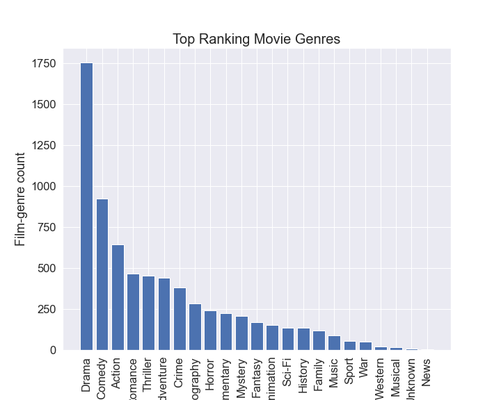

# MOVIE ANALYSIS
Business Problem Microsoft sees all the big companies creating original video content and they want to get in on the fun. They have decided to create a new movie studio, but they don’t know anything about creating movies. You are charged with exploring what types of films are currently doing the best at the box office. You must then translate those findings into actionable insights that the head of Microsoft's new movie studio can use to help decide what type of films to create.

### Business Understanding

The project aims to provide strategic guidance to Microsoft's new movie studio by analyzing the current trends and patterns in the film industry. By examining the performance of films at the box office, the analysis will uncover insights into successful genres, audience preferences, and market trends. These insights will empower the CEO to make informed decisions about the studio's content creation strategy, resource allocation, competitive positioning, and risk management efforts.

### Key Decisions and Goals Supported:

The analysis will support the CEO in making strategic decisions about the direction of the movie studio, including which genres or themes to prioritize and the target audience for the studio's productions. By understanding the types of films that are resonating with audiences, the CEO can allocate resources effectively and position the studio competitively in the market. Additionally, insights into competitors' strengths and weaknesses will inform decisions about content differentiation and market positioning. Overall, the project will provide actionable insights to guide Microsoft's new movie studio towards success in the dynamic and competitive film industry.

### Data understanding

For this analysis, datasets from BoxOffice Mojo, IMDB, and The Numbers were utilized to extract actionable insights for the head of Microsoft's new movie studio. These datasets provide comprehensive information about movies, including box office revenue, ratings, genres, runtime, and production budgets.

The IMDB datasets used in this project are divided into two main categories:

Title Basics Dataset: This dataset contains 146,144 items focusing on movie titles, genres, runtime, and release years. However, it has duplicates and missing values for runtime, which were addressed during data preparation. Title Rating Dataset: With 73,856 items, this dataset provides average ratings and the number of votes for each movie. It does not contain duplicates or missing values. Box Office Mojo is a valuable source for tracking box office revenue. The dataset used in this project includes 3,387 items and focuses on domestic gross, foreign gross, and distributor information. The primary focus of analysis was on domestic gross, which was converted from float to integer for clarity.

The Numbers dataset consists of 5,782 items and provides financial analysis for each movie, including production budgets and domestic gross. The production budget and domestic gross data initially had a '$' string value, which was converted to float and then to integer for consistency and ease of analysis.

By leveraging information from these datasets, this analysis aimed to address key questions posed in the business problem, with a focus on target variables such as genres, runtime, domestic gross, and production budget.

### Research Questions;

what are the most popular movie genres?
what is the average runtime minutes of a movie?
what is the average domestic gross for a standar movie?
what is the relationship between domestic gross profit and production budget?

# Data Cleaning & Preparation
Upon importing and reviewing the datasets, several data quality issues were identified, including missing values, duplicates, incorrect data types, and outliers for various variables relevant to the project's objectives.
  * From the IMDB data set i joined movie_basics and movie_ratings since they have the information i am intrested in working on. I also dropped duplicate titles primary_title and original_title. Dropping duplicates will help avoid getting skewed or misleading result from the analysis. I also found missing values on the runtime_minute column which I replaced with the mean. I avoided dropping them to avoid losing critical information on the other columns.
  * For the data set bom_movies, I first converted domestic_gross datatype from float to integer to avoid precision issues such as rounding errors.
  * For the dataset tnmovies_budget i converted the columns production_budget, domestic_gross and worldwide_gross from string to float and finally to integer. I also used the Stackerflow platform to help me remove the string element "dollar sign"
  
 After cleaning the data set I merged the movies_imdb dataset  to the bom_movies dataset which help me answer my first three research questions.
 The correlation between the production budget and domestic gross was purely done using the tnmovies_budget dataset.
 
 # Data Analysis
 HIGHEST RATED BASED ON NUMBER OF VOTES AND HIGHEST RANK
 I ranked the data based on their number of votes and average ratings. By ranking them according to their ratings/votes, as seen in the highest_rated_domestic dataset, I was able to identify the top-performing genres at the box office between 2010 and 2018. To analyze these top genres effectively, I opted for a bar plot due to its ability to provide a clear visual representation of categorical data against a quantitative scale
 Between 2010 and 2018, a thorough examination of genre popularity in the film industry showed people's preference. Drama films stood at the forefront, captivating audiences with their compelling narratives and relatable themes. Following closely behind, comedies consistently brought laughter to theatres, securing their place as the second most preferred genre. action-packed films, though thrilling and adrenaline-fueled, settled in third, while romance movies, with their heartwarming and often heart-wrenching tales, clinched the fourth spot. The ranking suggests a significant preference for story-driven genres, indicating a potential trend in audience desire to watch.

 
 
 
 
 
 